# Project Name - Peace Wave

#### 01. Brief Description of Project 

Peace Wave is a comprehensive stress relief application designed to help users manage and alleviate stress through a multifaceted approach. The app allows users to create and track their stress logs, exercise logs, listen to calming music, and experience immersive augmented reality environments. At the end of each month, users can view a detailed summary of their stress and exercise activities, helping them understand their progress and identify areas for improvement.

#### 02. Users of the System 

The primary users of Peace Wave are individuals seeking effective methods to manage and reduce stress in their daily lives. This includes:

1. Working Professionals: Looking to alleviate work-related stress and improve mental health.
2. Students: Managing academic pressures and maintaining a balanced lifestyle.
3. Fitness Enthusiasts: Tracking their exercise routines and understanding their impact on stress levels.
4. General Public: Anyone interested in using technology to support their mental well-being and relaxation.

#### 03. What is unique about your solution 

1. Comprehensive Logging System: Users can create detailed stress logs and exercise logs, providing a thorough record of their stressors and physical activities.
2. Calming Music Library: Access to a curated library of calming music and sounds designed to help users relax and unwind.
3. Augmented Reality Experiences: Immersive AR environments that offer a virtual escape and relaxation, enhancing the overall stress relief experience.
4. Monthly Summaries: Detailed monthly summaries that compile user data into insightful visualizations, helping users track their progress and identify patterns in their stress and exercise habits.

#### 04. Briefly document the functionality of the screens you have (Include screen shots of images)

1. The initial screen comprises an onboarding process consisting of three slides.

   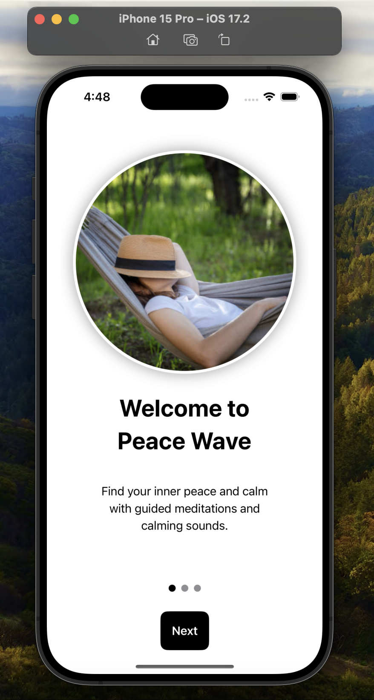
   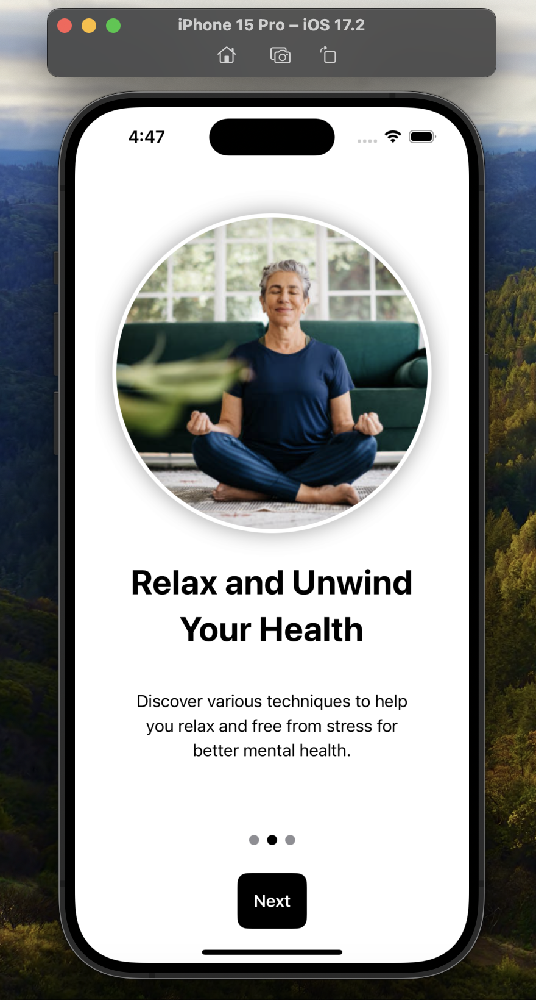
   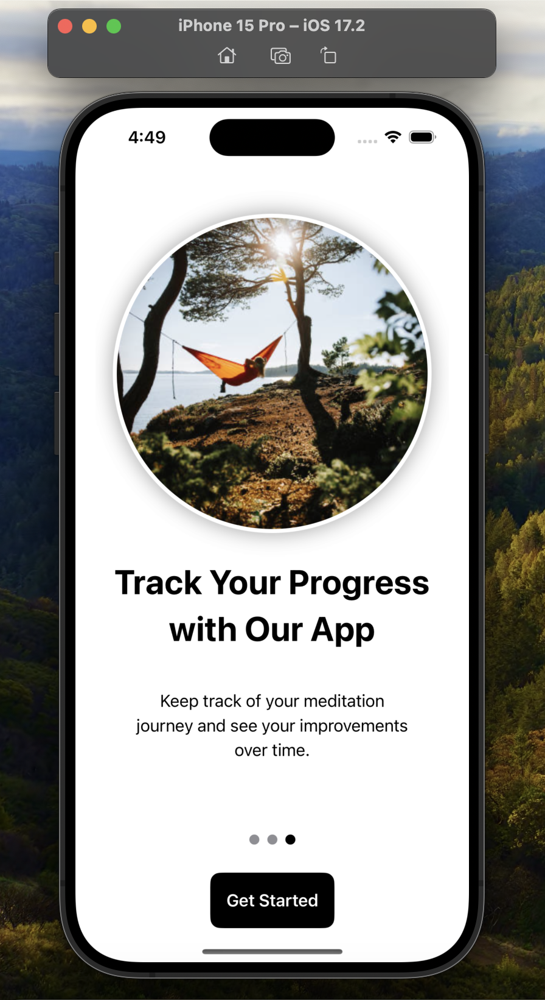

2. Home screen of the app containing navigation for summary view, stress management, exercise management, augmented reality, and music for stress relief.

    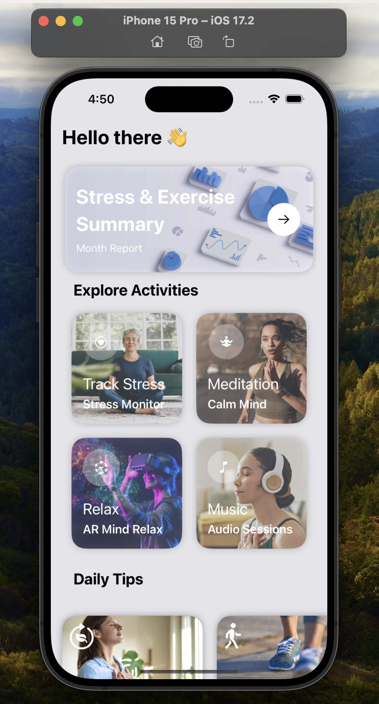

3. The stress logs page displays the stress logs that user has created.
   
    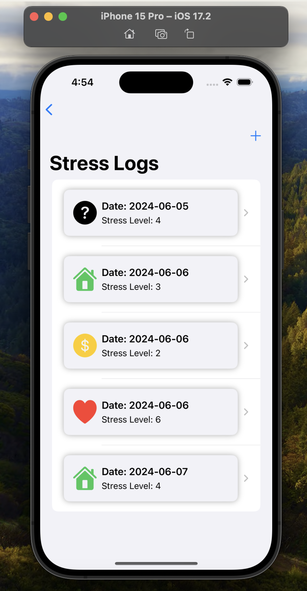
    
4. The new stress log page is used to create a new stress log by adding stress level, trigger, mood, sleep quality, physical activity and notes.

   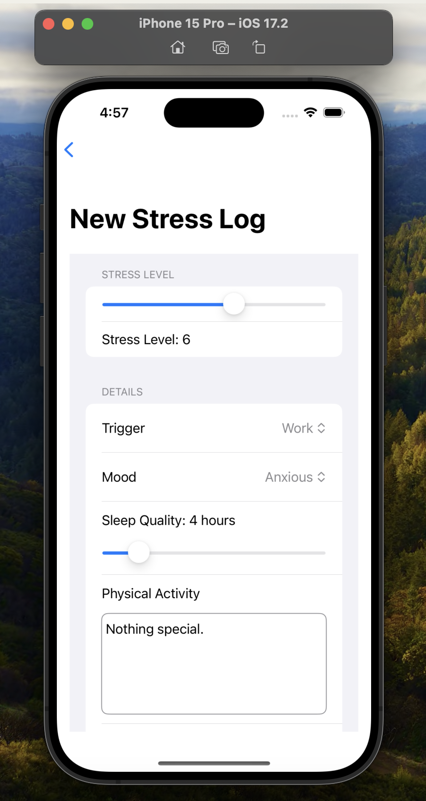

5. This page is used to view a detailed view of a stress log.

    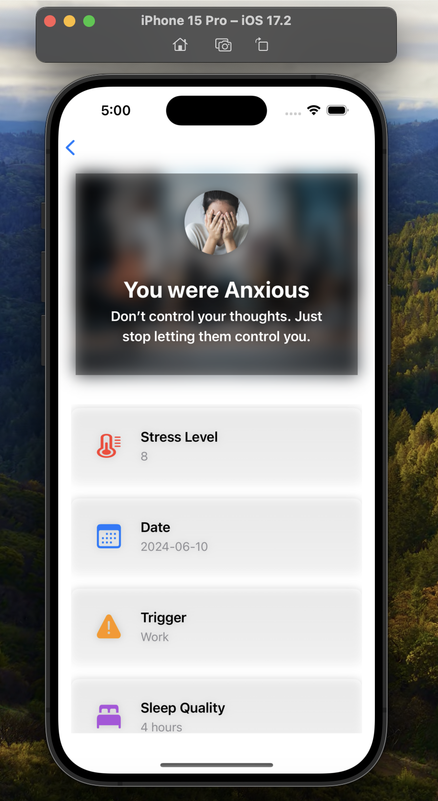
    
6. The exercise logs page displays the exercise logs that user has created.

   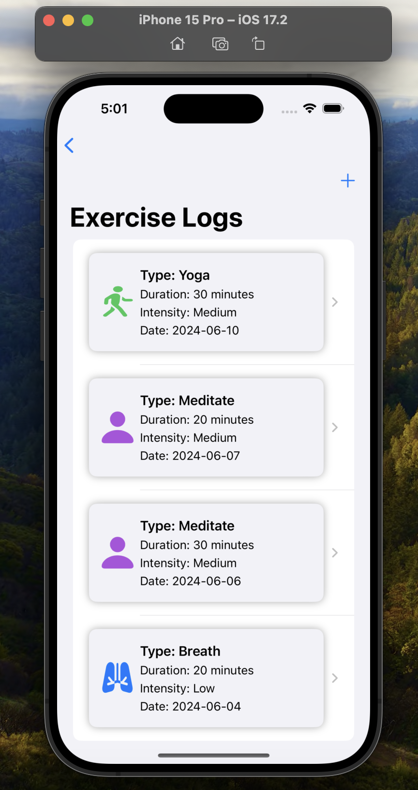

7. The new exercise page is used to create a exercise log by adding type, duration, intensity, date, and notes.

   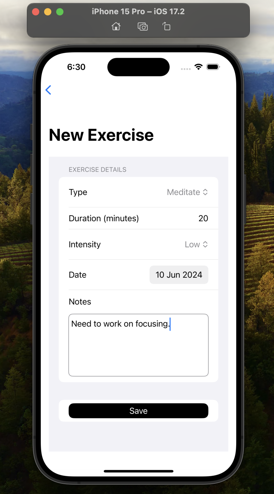

8. This page is used to view a detailed view of a exercise log.

   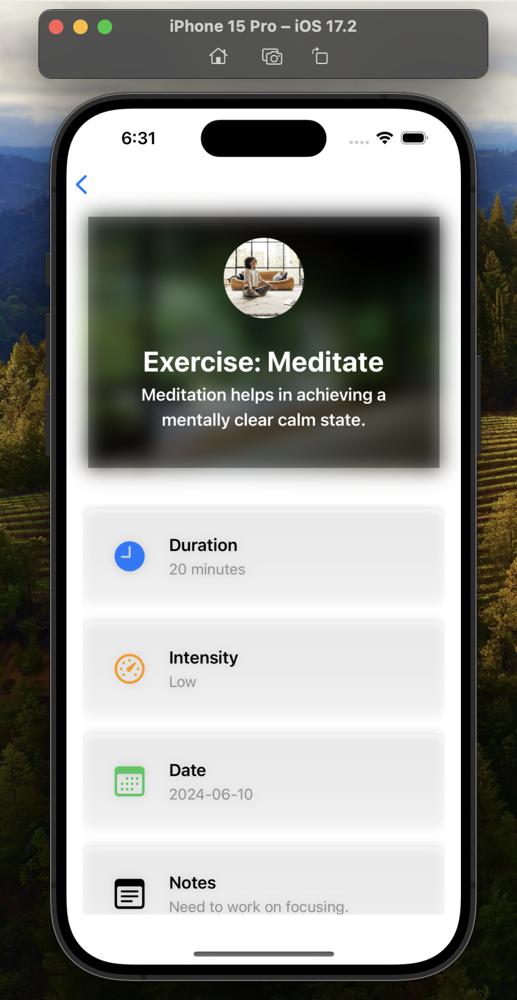

9. This immersive reality page let the user to experience a list of augmented reality views for stress relief.

   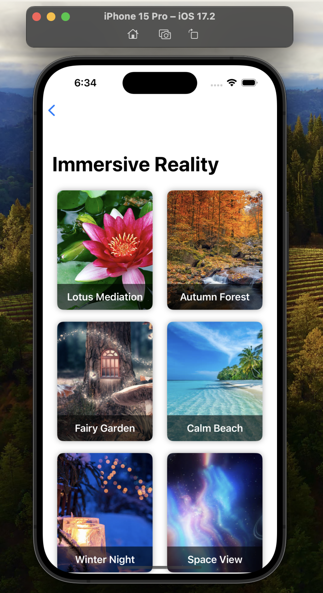
   
10. Users can observe virtual lotus flowers displayed onto their real-world environment using the device's camera.
  
    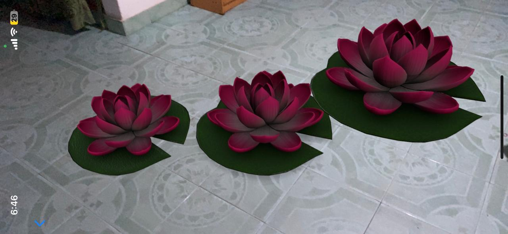

11. Users can immerse themselves in a serene skybox experience of an autumn forest, using the devices's camera.

    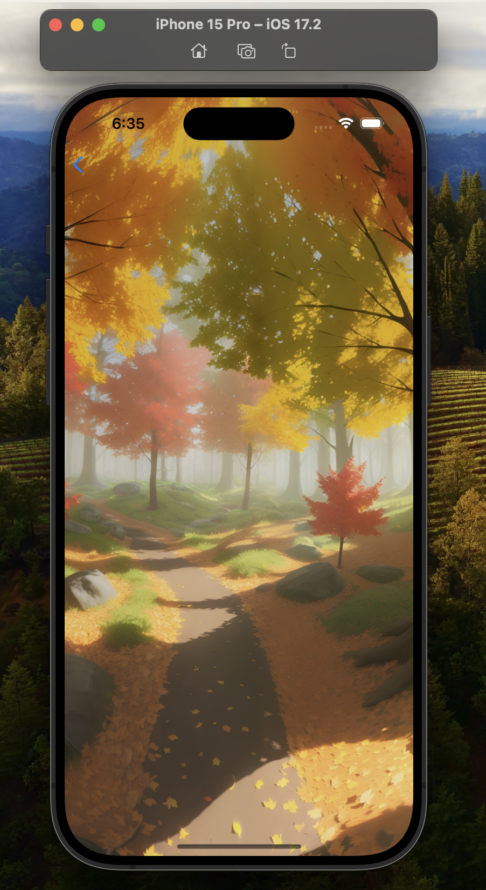

12. Users can immerse themselves in a serene skybox experience of a fairy garden, using the devices's camera.

    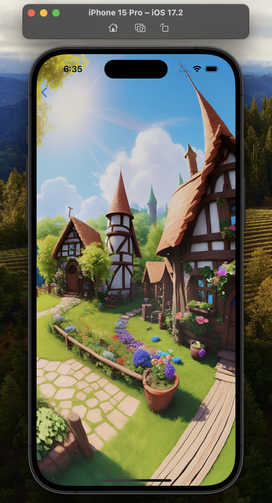

13. Users can immerse themselves in a serene skybox experience of a winter night, using the devices's camera.

    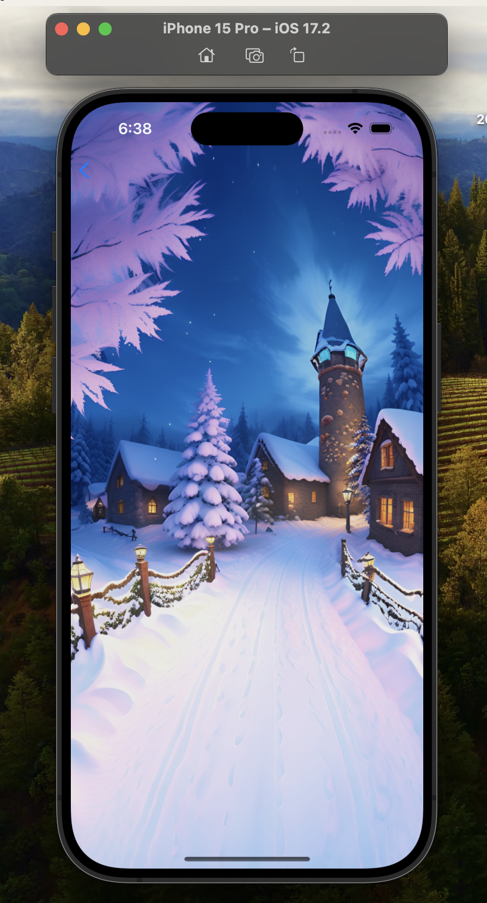

14. Users can immerse themselves in a serene skybox experience of a calm beach, using the devices's camera.

    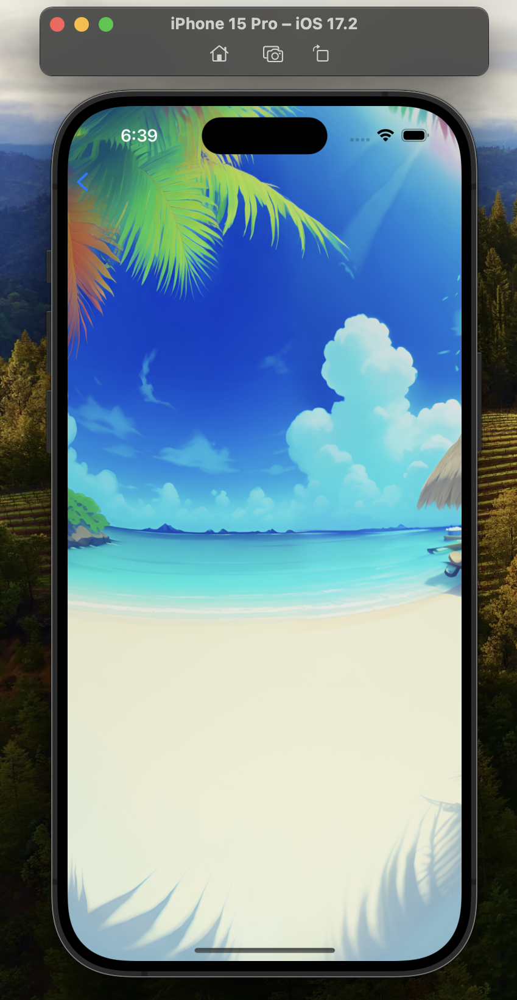

15. Users can immerse themselves in a serene skybox experience of a space view, using the devices's camera.

    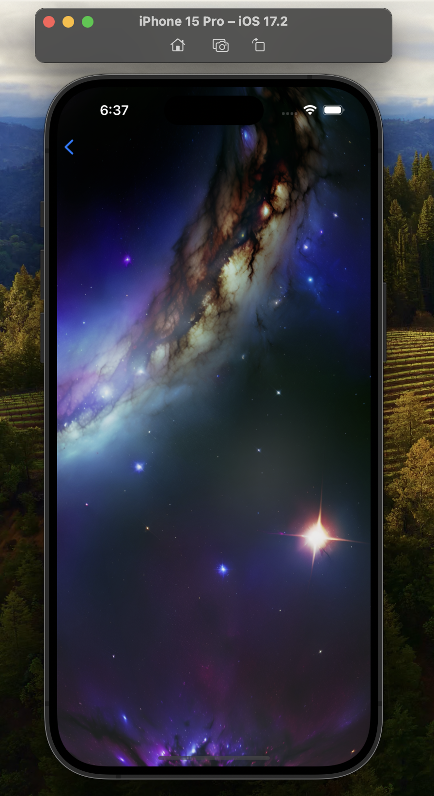

16. This page allows user to view a list of audios for stress release.

     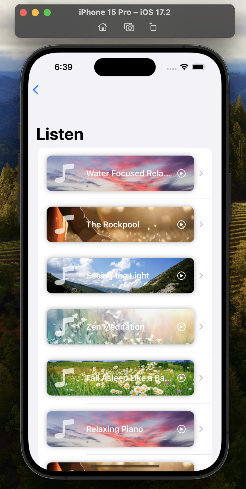

17. This page allows users to listen music for stress release.

    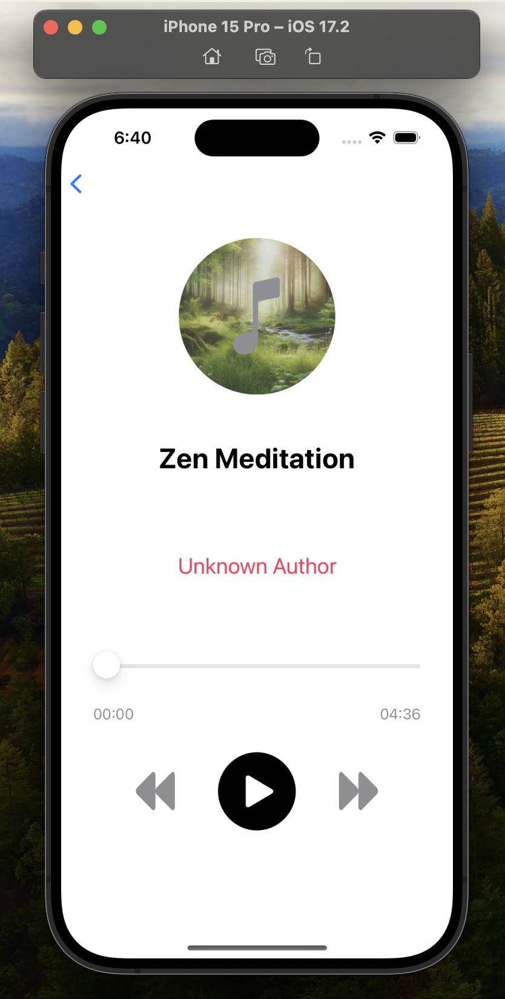